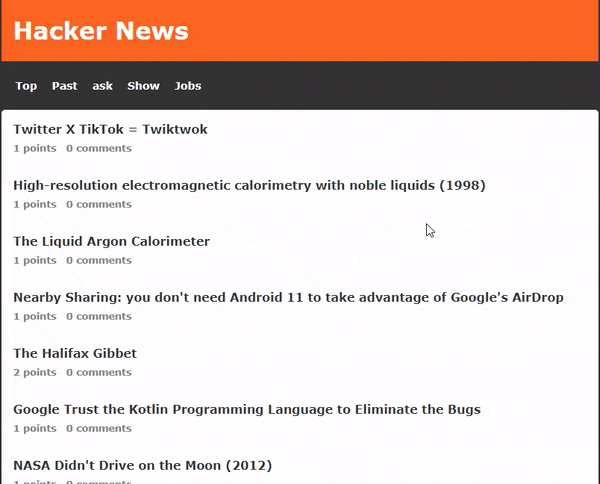

## Live Demo

# [Hacker News Clone](http://hacker-news-hack.vercel.app/)




## What I have used?
- NEXT.js 
- Vercel
- isomorphic fetch
- react loading skeleton


## Getting Started

First, run the development server:

```bash
npm run dev
# or
yarn dev
```

Open [http://localhost:3000](http://localhost:3000) with your browser to see the result.

You can start editing the page by modifying `pages/index.js`. The page auto-updates as you edit the file.


